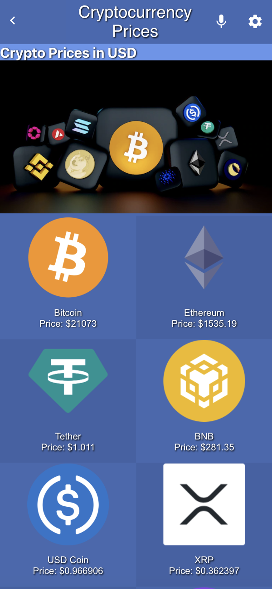
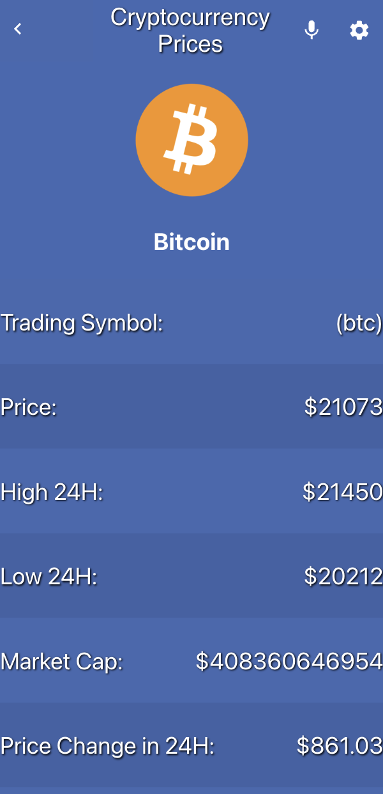
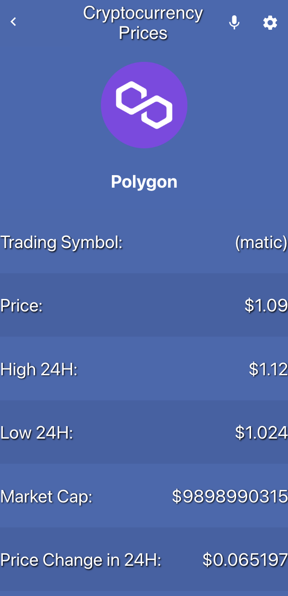

<a name="readme-top"></a>


## Screenshots
### ScreenShot

### ScreenShot

### ScreenShot



<!-- TABLE OF CONTENTS -->

# 📗 Table of Contents

- [📗 Table of Contents](#-table-of-contents)
- [📖 Crypto Price ](#about-project)
  - [🛠 Built With ](#-built-with-)
    - [Tech Stack ](#tech-stack-)
    - [Key Features ](#key-features-)
  - [🚀 Live Demo ](#-live-demo-)
  - [💻 Crypto Price ](#about-project)
  - [💻 Getting Started ](#-getting-started-)
    - [Prerequisites](#prerequisites)
    - [Setup](#setup)
    - [Install](#install)
    - [Usage](#usage)
    - [Run tests](#run-tests)
    - [Deployment](#deployment)
  - [👥 Authors ](#-authors-)
  - [🔭 Future Features ](#-future-features-)
  - [🤝 Contributing ](#-contributing-)
  - [⭐️ Show your support ](#️-show-your-support-)
  - [🙏 Acknowledgments ](#-acknowledgments-)
  - [📝 License ](#-license-)

<!-- PROJECT DESCRIPTION -->

## 📖 Crypto Price <a name="about-project"></a>

> Crypto Prices is a React.js and Redux web application that displays real-time market prices of cryptocurrencies fetched from the Coin Gecko API. Features include price history, currency conversion, and a user-friendly interface

## 🛠 Built With <a name="built-with"></a>

### Tech Stack <a name="tech-stack"></a>

> This project uses the following stack :

<details>
  <summary>Client</summary>
  <ul>
    <li><a href="https://reactjs.org/">React</a></li>
    <li><a href="https://redux-toolkit.js.org/">Redux Toolkit</a></li>
  </ul>
</details>
<details>
<summary>Server</summary>
  <ul>
    <li><a href="https://webpack.js.org/guides/getting-started/#basic-setup">Webpack Server</a></li>
    <li>APIs
    <ul>
    <li><a href="https://api.coingecko.com/api/v3/coins/markets?vs_currency=usd&order=market_cap_desc&per_page=100&page=1&sparkline=false">Crypto Prices </a></li>
    </ul>
    </li>
  </ul>
</details>

<!-- Features -->

### Key Features <a name="key-features"></a>

> Here are some key features of the application :

- **Display Top 100 Crypto**
- **Display Price in USD**
- **Display Low and High in last 24H**
- **Total Supply Circulating supply...etc**


<p align="right">(<a href="#readme-top">back to top</a>)</p>

<!-- LIVE DEMO -->

## 🚀 Live Demo <a name="live-demo"></a>

> Here you can visit my live demo :

- [Click Here](https://crypto-prices-reactjs.netlify.app/)

<p align="right">(<a href="#readme-top">back to top</a>)</p>

<!-- LIVE DEMO -->

## 💻 Crypto Price <a name="vgs-presentation"></a>

> Here you can see my presentation :

- [Click Here](https://www.loom.com/share/d29a0b3f4c214c37a68ad9f69ea99fea)

<p align="right">(<a href="#readme-top">back to top</a>)</p>

<!-- GETTING STARTED -->

## 💻 Getting Started <a name="getting-started"></a>

> Clone the repository by clicking on the 'Code' button and copy the link

To get a local copy up and running, follow these steps.

### Prerequisites

In order to run this project you need:

You should have node install on your local machine

### Setup

Clone this repository to your desired folder:

Example commands:

```sh
  cd my-folder
  git clone git@github.com:anas599/crypto-price.git
```

-

### Install

Install dependencies :

npm i

### Usage

To run the project, execute the following command:
Open the index.html file in a web browser

### Run tests

To run tests, run the following command:

```sh
  npm run test
```

To run the stylehint linter

```sh
  npx stylehint "**/*.{css,scss}"
```

To run the ESLint linter

```sh
  npx eslint "**/*.{js,jsx}"
```

### Deployment

You can deploy this project using:

```sh
  npm run build
```
```sh
  npm run start
```

<p align="right">(<a href="#readme-top">back to top</a>)</p>

<!-- AUTHORS -->

## 👥 Authors <a name="authors"></a>

👤 **Anas Sufyan**

- GitHub: [@anas599](https://github.com/anas599)
- Twitter: [@anas599](https://twitter.com/anas599)
- LinkedIn: [anas1993](https://linkedin.com/in/anas1993)


<p align="right">(<a href="#readme-top">back to top</a>)</p>

<!-- FUTURE FEATURES -->

## 🔭 Future Features <a name="future-features"></a>

- **Preserve the user data**

<p align="right">(<a href="#readme-top">back to top</a>)</p>

<!-- CONTRIBUTING -->

## 🤝 Contributing <a name="contributing"></a>

Contributions, issues, and feature requests are welcome!

Feel free to check the [issues page](../../issues/).

<p align="right">(<a href="#readme-top">back to top</a>)</p>

<!-- SUPPORT -->

## ⭐️ Show your support <a name="support"></a>

If you like this project star it!

<p align="right">(<a href="#readme-top">back to top</a>)</p>

<!-- ACKNOWLEDGEMENTS -->

## 🙏 Acknowledgments <a name="acknowledgements"></a>

I would like to thank the Microverse team.
The design used in this project was created by Nelson Sakwa on Behance and is licensed under the Creative Commons Attribution Attribution-NonCommercial 4.0 International (CC BY-NC 4.0) license.

<p align="right">(<a href="#readme-top">back to top</a>)</p>
<!-- LICENSE -->

## 📝 License <a name="license"></a>

This project is [licensed](./LICENSE) .

<p align="right">(<a href="#readme-top">back to top</a>)</p>
